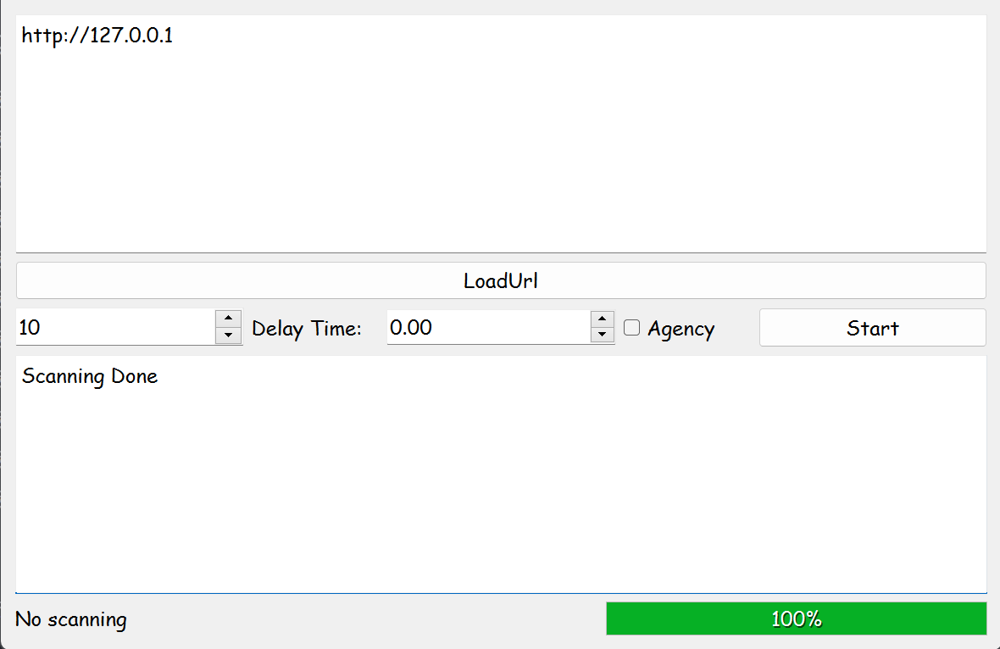
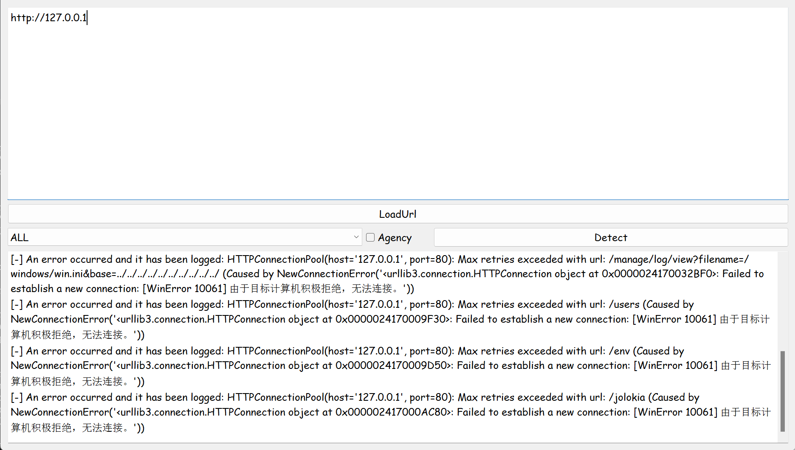
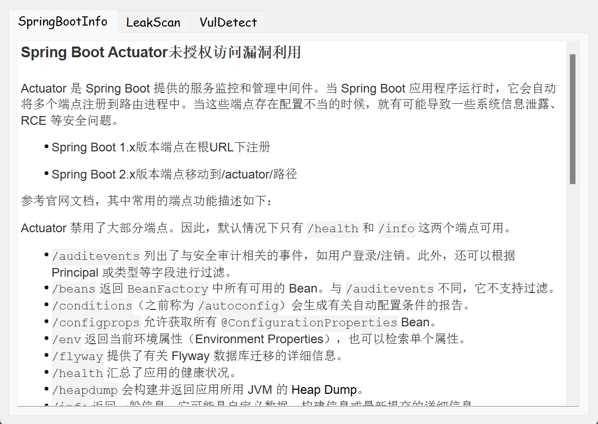

# Spring漏洞检测图形化工具

该工具是针对Spring的开源渗透框架，主要用作扫描Spring的敏感信息泄露端点，并可以直接测试Spring的相关高危漏洞。

目的是为了在工作中方便对spring进行快速检测。

主要特点：

使用pyside6开发的ui界面，支持多线程批量扫描。

使用了模块化的开发，每个页面以及poc都能够单独进行调试，可以方便的调试以及嵌入到其他工具中。

支持代理，再config.ini文件里可以设置代理。

python 版本：
Python 3.10.14

主要功能：

* 支持泄露扫描
* 支持2023 JeeSpringCloud 任意文件上传漏洞
* 支持CVE-2022-22947 (Spring Cloud Gateway SpELRCE漏洞)
* 支持CVE-2022-22963 (Spring Cloud Function SpEL RCE漏洞)
* 支持CVE-2022-22965 (Spring Core RCE漏洞)
* 支持CVE-2021-21234 (任意文件读取漏洞)
* 支持2021 SnakeYAML_RCE 漏洞
* 支持2021 Eureka_Xstream 反序列化漏洞
* 支持2020 Jolokia配置不当导致RCE漏洞
* 支持CVE-2018-1273（Spring Data Commons RCE漏洞）
* 支持批量漏洞验证模块

泄露扫描

漏洞检测

整体

参考：

https://github.com/AabyssZG/SpringBoot-Scan
